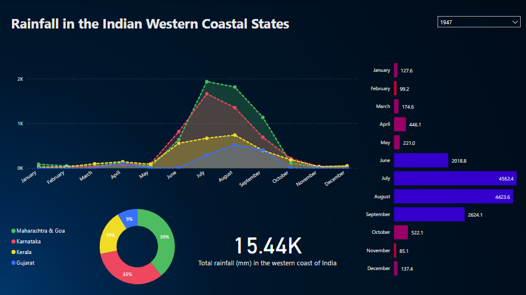

# Rainfall in the Indian Western Coastal States

- The dashboard describes the rainfall distribution amongst various Indian states along its western coast. It provides an interactive way to learn more about rainfall patterns and the changes it has seen in the last century.
- The data was obtained from the India Meteorological Department records hosted on the [Open Government Data Platform India](https://data.gov.in/catalog/rainfall-india?page=1) website.
- An example of what the dashboard looks like:

